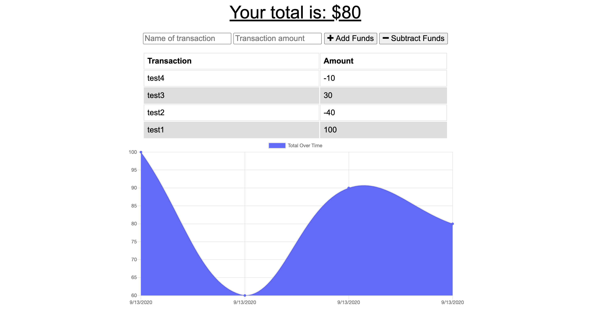

# Progressive Budget

## Description
➤ A budget tracker app that allows for offline access and functionality.

## Table of Contents
* [Installation](#installation)
* [Usage](#usage)
* [License](#license)
* [Contributing](#contributing)
* [Tests](#tests)
* [Questions](#questions)
* [Screenshot](#screenshot)
* [Deployed Application](#deployed-application)

## Installation
```
Run npm i to install all dependencies.
```

## Usage
➤ Run npm start to start the application. Can be used online and offline.

## License
This app is covered under the following license/s:


## Contributing
➤ This is an open-source project. Please feel free to contribute. Reach out to the author for more details.

## Tests
```
None
```

## Questions
Please direct all questions to:

👤 https://github.com/xtineroq


## Screenshot


## Deployed Application
[View on Heroku](https://fathomless-wave-20108.herokuapp.com/)
